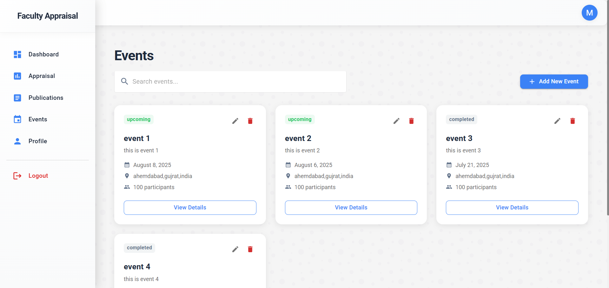

# 📚 Faculty Appraisal Management System

A web-based platform designed to streamline the faculty appraisal process for educational institutions. This system allows faculty members to submit appraisals under various categories, while administrators can view, manage, and respond to submissions efficiently.

---

## 🌐 Tech Stack

### Frontend:

* **React.js**
* **Vite**
* **CSS / Tailwind / Material UI (as applicable)**

### Backend:

* **Node.js**
* **Express.js**
* **MongoDB (via Mongoose)**

---

## ⚙️ .env Configuration

Create a `.env` file in the **backend** folder with the following:

```
PORT=5000
MONGO_URL=your_mongodb_connection_string
JWT_SECRET=your_jwt_secret
NODE_ENV=development
```

---

## 🛠️ Installation & Setup

### 1. Clone the Repository

```bash
git clone https://github.com/misel09/faculty-appraisal-system.git
cd faculty-appraisal-system
```

### 2. Backend Setup

```bash
cd backend
npm install
npm start
```

Runs on: `http://localhost:5000`

### 3. Frontend Setup

```bash
cd frontend
npm install
npm start
```

Runs on: `http://localhost:5173`

---

## 🖼️ Screenshots

## User Interface Previews

## Homepage


## Faculty Dashboard


## Event Management



## Publications Section


## Admin View


## Form Submission Process


## Report Generation


---

## ✅ Features

* Faculty Registration & Login
* Role-based Dashboard for Faculty & Admin
* Appraisal Form Submission
* Event, Publication, Research, and Teaching Records
* Admin Panel to View & Evaluate Submissions
* Report Generation Module

---

## 🧑‍💻 Best Practices

* Modular code structure
* Proper use of environment variables
* Secure password handling with bcrypt
* RESTful API conventions

---

## 📄 License

This project is licensed under the [MIT License](LICENSE).

---

## 🙌 Acknowledgements

Thanks to all contributors and mentors who helped build and refine this system.
